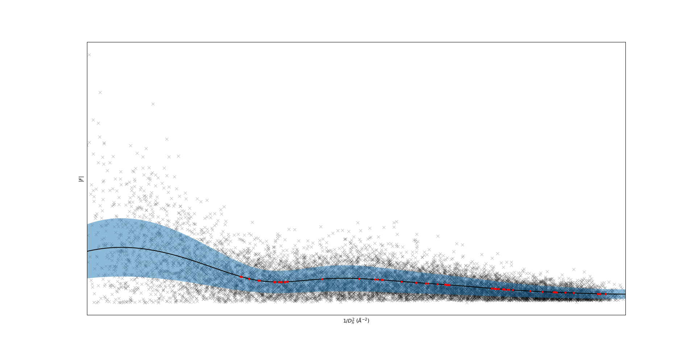

# UVScale 🕶️
The universal variational scaler for X-ray diffraction data. 
`UVScale` uses [pyro](https://pyro.ai/) to fit a stochastic process to your data. 
It's universal in the sense that the scales can depend on essentially anything rather than just resolution. 

